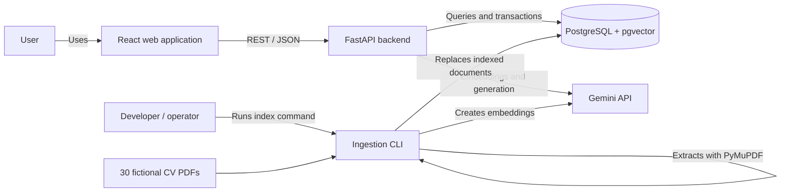
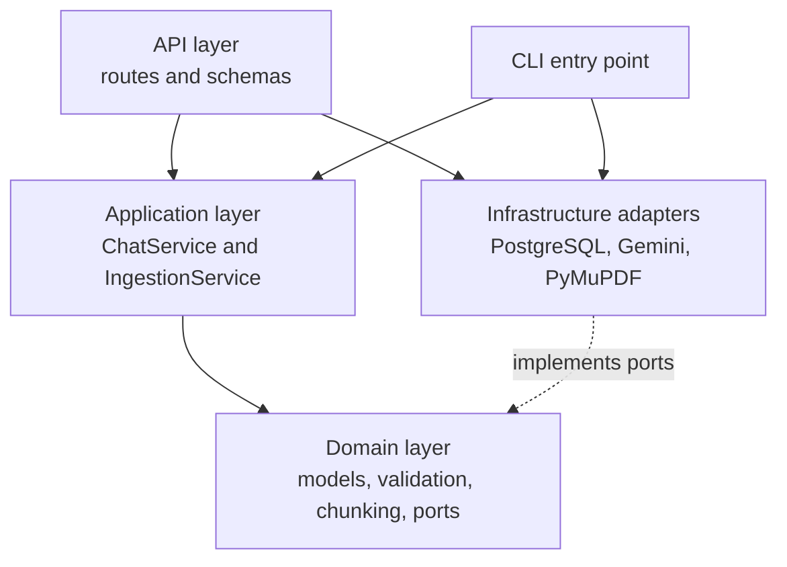
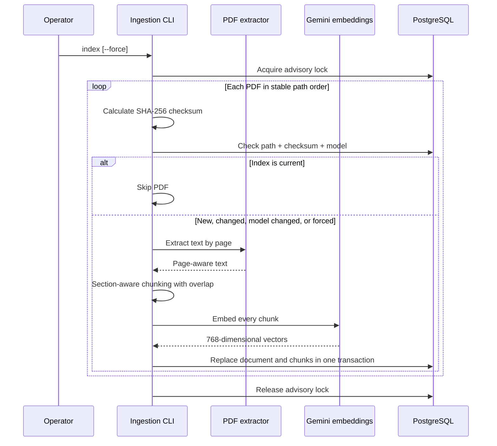
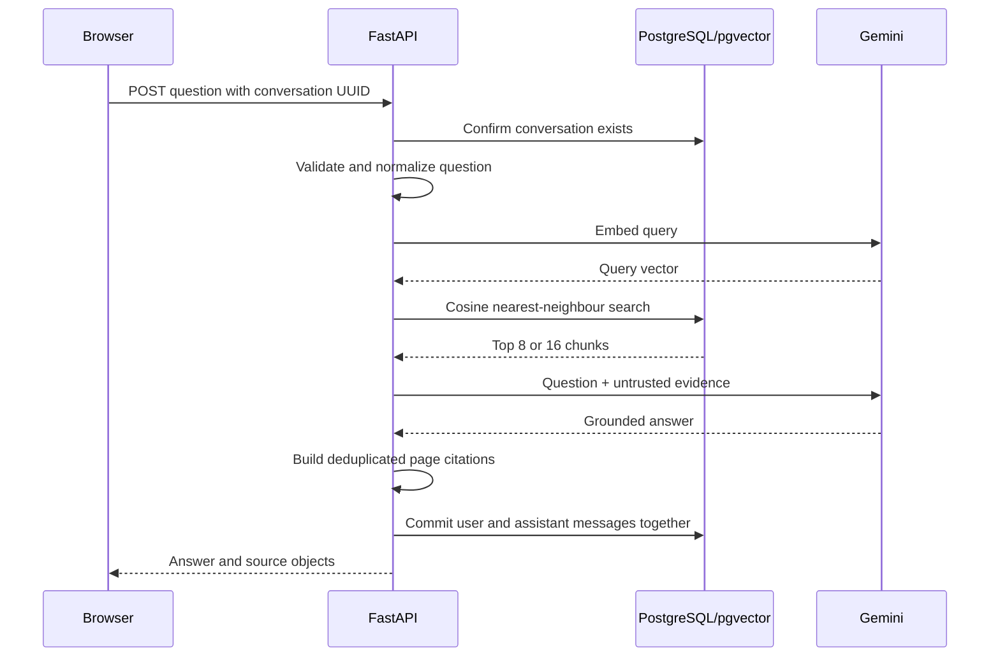
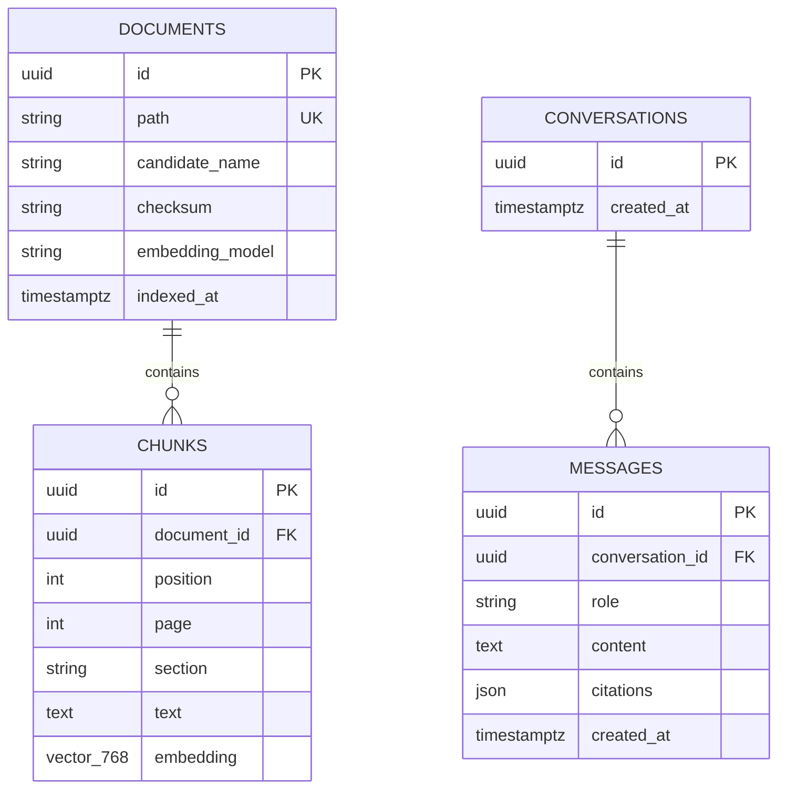

# Project architecture

## 1. Architectural purpose

CV Compass is a small evidence-grounded RAG application for asking questions about 30 fictional CVs. The architecture is designed around the actual assessment constraints: a small and mostly static corpus, roughly 50 moderate users, reproducible local setup, and answers that can be checked against a PDF page.

The architecture is deliberately production-shaped without pretending to be a complete enterprise platform. It uses clear internal boundaries, transactions, migrations, typed APIs, and provider adapters, while avoiding services and infrastructure that do not solve a current problem.

The primary quality goals are, in order:

1. **Grounding:** answers should be based on retrieved CV evidence.
2. **Traceability:** users should be able to inspect the candidate, page, and excerpt behind an answer.
3. **Simplicity:** the whole system should be understandable and runnable by one developer.
4. **Replaceability:** external providers and storage implementations should be changeable at defined boundaries.
5. **Measured growth:** more complex architecture should be introduced only when load, risk, or product requirements justify it.

## 2. System context



The browser never receives a provider key or a filesystem path. It communicates only with the backend. The backend owns validation, retrieval, model calls, persistence, and safe document lookup. The ingestion CLI uses the same application and infrastructure code as the API, so indexing does not require another deployed service.

## 3. Runtime components

### React frontend

The frontend is a static React application built with Vite and served by Nginx. It creates conversations, sends questions, renders saved messages and evidence, and opens PDFs through safe backend document IDs.

React was chosen because the chat interaction has meaningful client state and because a distinct frontend demonstrates a realistic API boundary. It costs an additional build toolchain. For a throwaway internal demo, a server-rendered page or Streamlit could be simpler; for this assessment, the control over interaction, accessibility, and API design is worth that cost.

### FastAPI backend

FastAPI exposes versioned REST endpoints for conversations, messages, and document files. Its routes are intentionally thin: Pydantic schemas validate the HTTP contract, dependencies assemble the application service, and use cases perform the work. The container starts two Uvicorn workers, giving modest process-level concurrency without adding an orchestration layer.

Async database and HTTP clients are useful because chat spends much of its time waiting for PostgreSQL and Gemini. Async does not make model inference faster, but it allows a worker to serve other I/O while waiting.

### PostgreSQL with pgvector

PostgreSQL stores document metadata, chunks, embeddings, conversations, messages, and citation snapshots. pgvector adds cosine-distance search and an HNSW index. Keeping relational data and vectors together gives the project one transaction model, backup target, migration system, and operational dependency.

This is appropriate for the current corpus. A dedicated vector database would add synchronization and failure modes before it adds useful scale. If vector search later becomes the measured database bottleneck, retrieval can be separated while PostgreSQL remains the system of record.

### Gemini

Gemini provides two capabilities behind application ports:

- document and query embeddings;
- grounded answer generation.

The adapter supplies different embedding task types for documents and queries, fixes vectors at 768 dimensions, uses a 30-second timeout, and retries transient failures up to three attempts. It does not retry permanent client errors. Model names are configuration rather than business logic.

### Ingestion CLI

Indexing is an explicit command because the provided dataset is committed and changes rarely. The CLI is easier to run, observe, and recover than a queue-based workflow at this scale. A PostgreSQL advisory lock ensures only one index run is active at a time.

If users could upload documents or indexing took minutes or hours, the correct architecture would change to object storage, a durable job queue, and independently scalable ingestion workers.

## 4. Backend internal architecture

The backend is a modular monolith that applies dependency inversion:



Dependencies point toward the use cases and domain contracts:

- `domain` knows nothing about FastAPI, SQLAlchemy, Gemini, or PDF libraries;
- `application` coordinates domain behavior through repository, embedder, extractor, and generator ports;
- `infrastructure` implements those ports using external technology;
- `api` translates HTTP data and assembles dependencies;
- `cli` is a second delivery mechanism for the ingestion use case.

This structure creates useful testing and replacement seams without separate network services. For example, deterministic test fakes can replace Gemini and PostgreSQL at the application boundary. A new model provider requires a new adapter, not a new chat use case.

It is not strict ceremony for every function. There is no separate service for retrieval, no internal event bus, and no generic repository framework. Those abstractions would add indirection without providing a second real implementation or a current coordination need.

## 5. Ingestion flow



The checksum avoids paying for extraction and embeddings when neither the file nor embedding model has changed. Including the model in the freshness check matters because vectors from different models must not be mixed.

Chunking preserves the PDF page and detected résumé section. Chunks are capped at approximately 1,400 characters with 150-character overlap. The overlap reduces the chance of losing meaning at an arbitrary boundary; its tradeoff is duplicated tokens and potentially similar search results.

Replacement is atomic per document. The old document and cascading chunks are deleted and the new version is inserted in one transaction. If extraction or embedding fails, replacement has not started. If a database write fails, it rolls back. This favors a complete previous index over exposing a partial new one.

Current limitations are intentional:

- embeddings are requested one chunk at a time, which is simple but slower than batching;
- document identity is its local path, which is suitable for committed files but not durable object identity;
- indexing is sequential, avoiding quota spikes and concurrency coordination;
- there is no document-version history after a successful replacement.

For a large or frequently changing corpus, use stable document IDs, object storage, batch embeddings, durable jobs with idempotency keys, document/index versions, retry and dead-letter handling, and an atomic “publish version” step after all chunks succeed.

## 6. Question-answering flow



Comparison-like wording retrieves 16 chunks instead of the ordinary 8 to increase candidate coverage. Retrieved evidence includes candidate names and pages and is labelled as untrusted data in the model instruction. The model is told not to follow CV instructions, infer protected traits, or make hiring decisions, and to refuse when evidence is insufficient. Temperature is set to 0.1 to reduce unnecessary variation.

Citations are derived from the retrieved results, deduplicated by document and page, capped at six, and stored as snapshots on the assistant message. The API returns document IDs, names, pages, and excerpts—not paths. This makes the response inspectable and preserves what the user saw even if a CV is reindexed.

There are important boundaries to what this guarantees:

- retrieval can miss relevant evidence;
- retrieved evidence can still be misunderstood by the model;
- a citation proves provenance, not correctness;
- the comparison-word heuristic is not a general comparison engine;
- saved conversation history is displayed but is not currently sent to Gemini, so each question is answered independently rather than as a contextual follow-up.

That last choice bounds prompt size and avoids ambiguous history behavior. If conversational follow-ups become a requirement, load a bounded number of previous messages, separate prior user intent from retrieved evidence, summarize old turns, and test for prompt injection and context drift. Do not simply append an unlimited transcript.

## 7. Data architecture



The schema separates documents from chunks because ingestion operates on complete PDFs while retrieval operates on passages. `(document_id, position)` prevents duplicate positions, and cascading foreign keys prevent orphaned chunks or messages. UUIDs are safe opaque identifiers at the API boundary.

Messages are rows rather than one growing conversation JSON object. This supports append-style writes, bounded history reads, and straightforward ordering. Citation JSON is a deliberate denormalization because evidence is small, immutable in the context of a response, and always read with its message.

If citation analytics or regulated audit integrity becomes important, introduce normalized generation and citation tables containing chunk version, rank, retrieval score, model, prompt version, and generation settings. If the system becomes multi-tenant, add tenant ownership to every relevant row and ensure the tenant predicate is applied before vector ranking, backed by row-level security.

The detailed schema tradeoffs are recorded in [decisions.md](decisions.md).

## 8. Deployment architecture

The local deployment uses Docker Compose:

```mermaid
flowchart TB
    B[Browser] -->|localhost:5173| N[Nginx container<br/>static React files]
    N -. browser calls .->|localhost:8000| A[API container<br/>2 Uvicorn workers]
    A -->|private Compose network| P[(PostgreSQL 16 + pgvector)]
    A -->|HTTPS| G[Gemini API]
    V[Read-only CV bind mount] --> A
    PG[Named PostgreSQL volume] --> P
```

The API runs Alembic migrations before startup. PostgreSQL has a readiness check and persistent named volume. CV files are mounted read-only. Environment variables supply database, CORS, model, and provider configuration; secrets remain server-side.

This is a development and evaluation topology, not a high-availability one. A production deployment would build immutable images, terminate TLS at an ingress or load balancer, store secrets in a secret manager, place PDFs in private object storage, use managed PostgreSQL with backups, and run stateless API replicas across failure zones.

## 9. Reliability and failure behavior

The design makes common failures explicit:

| Failure | Current behavior | Larger-system response |
|---|---|---|
| Unchanged PDF | Skipped using checksum and model | Preserve idempotency key in background jobs |
| Indexing process overlaps | Advisory lock serializes runs | Queue ownership or distributed job leasing |
| PDF cannot be extracted | Index command fails; old version remains | Mark job/document failed and expose retry/review state |
| Embedding request fails | Transient retries, then no replacement | Durable retry with backoff and dead-letter handling |
| Generation request fails | API returns a controlled provider error; exchange is not saved | Circuit breaker, provider fallback, queued generation if needed |
| Database connection is stale | Pool pre-ping replaces it | Managed pooler, saturation alerts, load shedding |
| Database write fails | Transaction rolls back | Same model plus retry only when operation is idempotent |
| Invalid conversation UUID | Not-found response | Authenticated ownership check before existence disclosure |
| Browser disconnects during generation | Server request may finish; client has no stream/job recovery | SSE for delivery or durable job execution for survival |

The connection pool allows ten persistent and ten overflow connections per worker process. Because the container runs two workers, the potential total is higher than the per-process values. When adding API replicas, pool capacity must be calculated across all workers and compared with PostgreSQL limits; multiplying replicas without this calculation can exhaust the database.

Request IDs support log correlation, and liveness and readiness endpoints distinguish a running process from one that can reach PostgreSQL. A real service should add metrics for request latency, provider latency and errors, database pool saturation, retrieval quality, token usage, and cost, plus tracing across retrieval and generation.

## 10. Security and privacy boundary

This repository contains synthetic CVs and is intended for local evaluation. Conversation UUIDs provide convenient isolation in the browser, but they are bearer-like identifiers, not authentication or authorization. The conversation-list endpoint is also not user-scoped. The system must not be deployed publicly with real CVs in its current form.

Before handling real or multi-tenant data, add:

- identity-provider authentication and explicit conversation/document ownership;
- authorization on every list, message, retrieval, and file request;
- tenant filtering before vector search and row-level security as defense in depth;
- private object storage rather than local paths and mounts;
- malware scanning, file-size/type limits, sandboxed parsing, and OCR controls for uploads;
- encryption, audit logs, secret rotation, retention, deletion, and backup policies;
- log redaction and a review of external model-provider data processing;
- bias, quality, and human-oversight controls appropriate to hiring decisions.

Prompt instructions reduce indirect prompt-injection risk but are not a security boundary. Retrieved text remains untrusted, tool access should remain minimal, and model output must not directly authorize actions or make autonomous hiring decisions.

## 11. Scaling by scenario

Architecture should evolve in response to a specific pressure:

| Scenario | First changes | Changes to defer until demonstrated |
|---|---|---|
| More concurrent chat users | Metrics, quotas, more stateless API replicas, managed pooling | Microservices and read replicas without database evidence |
| Slow answers | Measure retrieval vs provider time, stream with SSE, reduce prompt size | A queue if the only need is visual token streaming |
| Generation must survive disconnects | Durable job, message status, polling or event subscription | General event-driven architecture across all operations |
| Frequent uploads | Object storage, durable ingestion queue, idempotent workers | Separate service per PDF-processing step |
| Millions of chunks | Evaluation set, hybrid search, index tuning, partitioning | External vector database until pgvector is measured as limiting |
| Exact skill or compliance filtering | Structured extraction, validated fields, relational queries | Asking the LLM to perform deterministic filtering |
| Complex candidate comparison | Candidate-diverse retrieval, per-candidate facts, reranking | Autonomous applicant ranking or rejection |
| Scanned documents | OCR with confidence scores and review paths | Treating uncertain OCR text as authoritative evidence |
| Multi-tenant SaaS | Authentication, tenant columns, prefiltered retrieval, RLS, audit | Scaling traffic before fixing data isolation |
| Higher availability | Managed multi-zone database, backups and restore tests, multiple API replicas, circuit breakers | Multi-region active-active consistency unless required |
| Separate engineering teams | Extract ingestion or model orchestration along ownership boundaries | Splitting services only by technical layer |

### Retrieval growth path

Improve retrieval in the least complex order that solves measured quality problems:

1. establish labelled questions and expected evidence;
2. measure recall, faithfulness, latency, and cost;
3. add metadata filters and PostgreSQL full-text/vector hybrid search;
4. diversify results so one candidate cannot occupy every slot;
5. add a reranker;
6. tune or partition pgvector;
7. adopt a separate vector service only when its operational cost is justified.

### Service extraction path

Keep the modular monolith while one team owns it and components share a release cadence. Ingestion is the most likely first extraction because it can be resource-heavy and asynchronous. If it becomes a service, publish changes through an outbox or another durable consistency mechanism so PostgreSQL metadata and index events cannot silently diverge. Extract chat/model orchestration only if independent ownership, scaling, compliance, or provider policy requires it.

## 12. Simplicity over overengineering

The project uses architectural seams without deploying speculative infrastructure. That distinction keeps it easy to change without making it expensive to operate.

| Simple choice | Why it fits this project | Evidence that would justify more |
|---|---|---|
| Modular monolith | One team and one small backend | Independent release ownership or incompatible scaling |
| PostgreSQL for records and vectors | Small corpus and one consistency boundary | Vector workload measurably harms database objectives |
| Explicit indexing CLI | Static committed dataset | User uploads or retryable long-running ingestion |
| Sequential embedding calls | Predictable quota use and simple recovery | Ingestion duration becomes unacceptable |
| Synchronous request/response | Moderate users and bounded model timeout | Disconnect survival or gateway timeout requirements |
| Stateless API replicas | No server-local session state | A workflow requires durable asynchronous state |
| Fixed top-k retrieval | Understandable baseline | Evaluation demonstrates recall or diversity failures |
| Citation JSON snapshot | Small evidence read with its message | Relational integrity, analytics, or audit requirements |
| One provider adapter | Small scope and replaceable port | Availability, residency, cost, or quality targets require fallback |
| Docker Compose | Reproducible local evaluation | Production scheduling and availability requirements |

The rule is not “never add complexity.” It is “add the smallest mechanism that addresses an observed constraint.” Clean ports, stable IDs, database migrations, transactions, and stateless HTTP are inexpensive foundations. Microservices, queues, caches, event buses, a separate vector store, and orchestration platforms create ongoing operational obligations and should arrive with a concrete requirement, owner, and success metric.

## 13. Architecture summary

For this project, the chosen architecture is a balanced first version:

- React provides a realistic user interface and clean client boundary.
- FastAPI provides typed async HTTP APIs and thin delivery logic.
- A modular monolith keeps use cases separated without distributed-system overhead.
- PostgreSQL and pgvector keep relational consistency and retrieval in one store.
- Gemini is isolated behind ports so application behavior remains testable and replaceable.
- The CLI makes static ingestion explicit, deterministic, and recoverable.
- Citations and page-aware chunks make answers inspectable rather than opaque.

Its limitations—anonymous access, independent rather than contextual chat turns, synchronous provider calls, sequential ingestion, and one database—are explicit. They are acceptable for a synthetic assessment and each has a clear evolution path if the operating situation changes.
