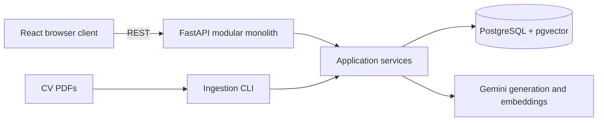
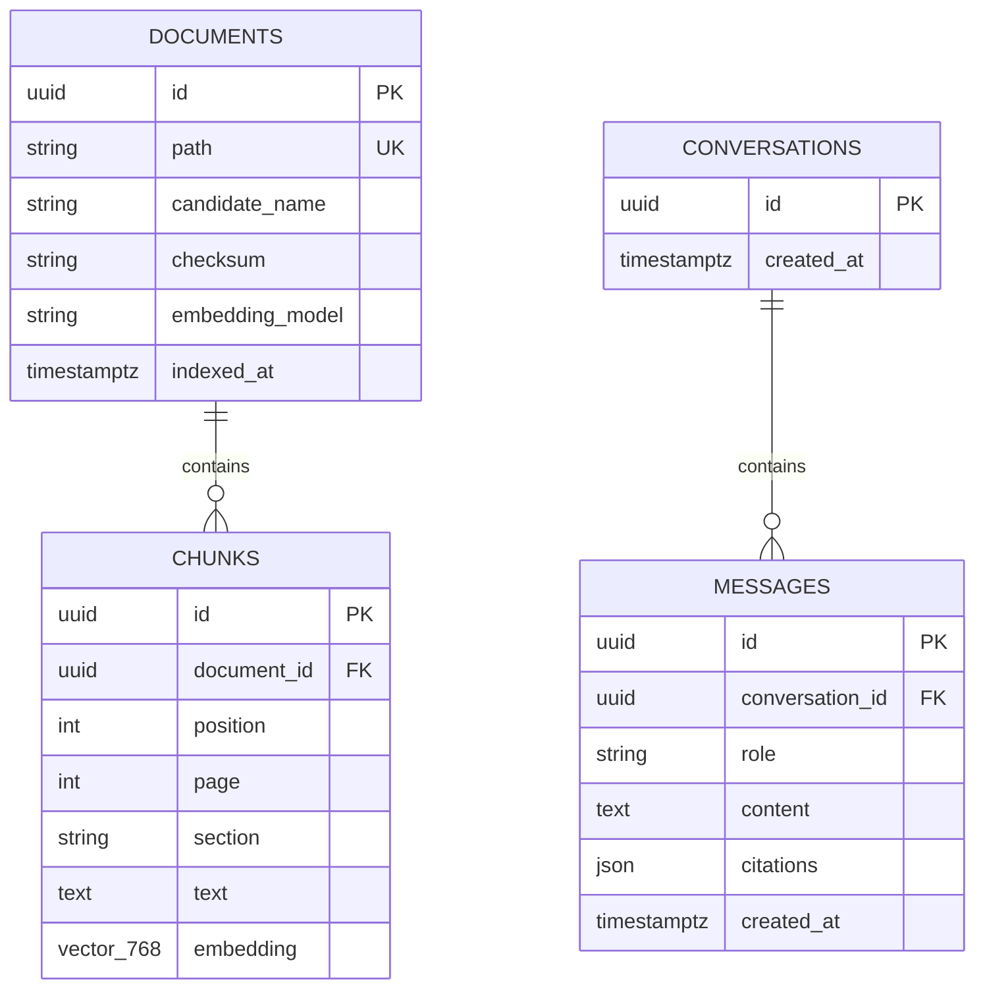

# Architecture decisions and tradeoffs

## 1. Context and design goals

CV Compass is an evidence-grounded retrieval-augmented generation (RAG) prototype over 30 fictional CVs. Its expected load is about 50 moderate users, the corpus changes infrequently, and the main product risk is an answer that is unsupported by the CVs—not raw throughput.

The architecture therefore optimizes for:

- answers that can be traced back to a candidate and PDF page;
- a setup that an evaluator can run locally;
- deterministic tests without consuming an LLM quota;
- clear boundaries so external services can be replaced later; and
- the fewest independently operated components that satisfy those needs.

This context matters. The chosen design is appropriate for a small assessment and an early product, but it is not presented as the final architecture for a public, multi-tenant recruitment platform.

## 2. System design

The system has three runtime components: a React frontend, a FastAPI backend, and PostgreSQL with pgvector. A separate CLI performs ingestion, but it runs the same backend application code rather than introducing another service.

There are two main flows:

1. **Ingestion:** calculate a PDF checksum, extract page-aware text, split it into section-aware chunks, create embeddings, and atomically replace that document and its chunks. The checksum and embedding model make repeated indexing idempotent. An advisory lock prevents two indexing commands from running concurrently.
2. **Question answering:** validate the conversation and question, embed the question, run cosine-similarity search over chunks, send the retrieved evidence to Gemini, derive page-level citations from the same results, and store the user/assistant exchange in one commit.

The important boundary is that the model does not search files or the database itself. The application selects the evidence and gives it to the model as untrusted context. This makes the flow easier to test and limits both hallucination opportunities and indirect prompt injection.

## 3. Why a modular monolith

The backend is one deployable application, internally divided into domain, application, API, and infrastructure layers.

- **Domain** contains data structures, validation, and chunking rules.
- **Application** coordinates ingestion and chat use cases.
- **Infrastructure** implements PostgreSQL, PDF, and Gemini adapters.
- **API** translates HTTP requests and responses.

This gives most of the useful separation of microservices without service discovery, distributed tracing, network failure handling, multiple deployments, or cross-service consistency. The application services depend on small ports rather than SQLAlchemy or Gemini directly, which is why tests can use in-memory fakes and why a provider or repository can be replaced without rewriting the use case.

The tradeoff is that all backend capabilities scale and deploy together. A slow ingestion workload can contend with chat, and teams cannot independently release bounded contexts. For 30 CVs and one small team, those costs are smaller than the operational cost of microservices.

If ingestion consumed substantial CPU, had a different release cadence, or was owned by another team, it should become a worker behind a durable queue. If chat and document management needed independent scaling or ownership, the existing application ports provide reasonable extraction seams. Service boundaries should follow measured load and team ownership, not be introduced in anticipation of them.

## 4. Why FastAPI and React

FastAPI provides typed request validation, async I/O for database and model calls, automatic OpenAPI documentation, and a small amount of framework code. React demonstrates a realistic API/client boundary and supports an accessible, responsive conversation UI.

The cost is two toolchains and a cross-origin deployment boundary. A server-rendered UI or Streamlit would be faster for an internal experiment, but would hide API design and offer less control over interaction and accessibility. Conversely, a larger frontend framework with server rendering would add capabilities this authenticated, SEO-free prototype does not need.

**Other situations:** for a disposable analyst tool, Streamlit could be the correct choice. For a public content site needing SEO and server rendering, Next.js or another SSR framework could be justified. For multiple clients such as web and mobile, keeping the explicit API boundary becomes even more valuable.

## 5. Database design and rationale

One PostgreSQL database stores source metadata, vector-search data, and conversation state:

### Documents and chunks

`documents.path` is unique because a file is the ingestion identity in this local dataset. `checksum` detects content changes and `embedding_model` forces reindexing when vector semantics change. Chunks are separate rows because retrieval operates at a smaller unit than a complete CV. `(document_id, position)` is unique, the foreign key cascades on deletion, and replacement occurs in a transaction so a failed reindex does not leave a half-indexed document.

Page and section are stored alongside chunk text. This duplicates information that could be reconstructed, but makes citations and filtered retrieval cheap and reliable. Embeddings are fixed at 768 dimensions because PostgreSQL vector columns and indexes require a known dimensionality; changing dimensions intentionally requires a migration and full reindex.

Cosine distance matches normalized semantic similarity and an HNSW index provides approximate nearest-neighbour search with good query latency. HNSW consumes more memory and is slower to build than exact search, and at only 30 CVs a sequential vector scan would also work. It is included because it demonstrates the intended query path and gives a reasonable growth baseline without introducing another service.

### Conversations and messages

Conversations are deliberately minimal because there are no accounts. Messages are append-only rows ordered by timestamp and UUID, which is easy to inspect and avoids repeatedly rewriting a large conversation JSON document. The user question and assistant answer are committed together so a successful exchange is not partially persisted.

Citations are stored as a JSON snapshot on the assistant message. This is intentionally denormalized: citations are response evidence, small, read with their message, and should preserve what the user saw even if a CV is later reindexed. The tradeoff is weaker relational validation and harder cross-citation analytics. A regulated product should use normalized `message_citations` rows, retain document/chunk versions, and store generation metadata such as model, prompt version, retrieval scores, and timestamps.

### Why PostgreSQL with pgvector

PostgreSQL supplies ACID transactions, foreign keys, ordinary metadata queries, conversation persistence, and vector search in one operational unit. SQLite is excellent for a single-user demo but has weaker concurrent-write behavior and lacks this production-like vector path. A dedicated vector database would add credentials, synchronization, backup, and consistency concerns while providing little benefit for this corpus.

The limitation is that one database handles both transactional and vector workloads. Very large embedding collections can create memory, index-build, backup, and replication pressure. That is a reason to measure and split later, not a reason to pay the distributed-systems cost now.

**Other situations:**

- For a desktop-only, single-user application, use SQLite plus an in-process vector index.
- For millions of frequently updated chunks or independently scaled retrieval, keep metadata in PostgreSQL and use a managed vector engine, with stable chunk IDs and an outbox/queue to synchronize changes.
- For rich keyword requirements, add PostgreSQL full-text search first and combine lexical and vector ranks before adopting another datastore.
- For multiple customers, add `tenant_id` to every owned table, include it in indexes and every retrieval predicate, and enforce isolation with PostgreSQL row-level security as defense in depth.

## 6. Retrieval, grounding, and citations

Section-aware, overlapping chunks preserve résumé structure while remaining small enough for focused retrieval. The question is embedded and compared with chunk embeddings using cosine distance. Ordinary questions retrieve eight chunks; simple comparison wording retrieves sixteen to improve candidate coverage. The answer prompt uses low temperature, explicit evidence boundaries, and a grounded refusal instruction.

This is intentionally a compact retrieval pipeline. It is understandable and testable, but the comparison-word heuristic is not a general query planner, vector similarity can miss exact names or rare skills, and top-k chunks can overrepresent one candidate. Citations prove provenance, not that the model interpreted evidence correctly. The system assists human review and must not autonomously rank or reject applicants.

If retrieval quality becomes insufficient, evolve it in measured steps:

1. create a labelled evaluation set and measure recall, faithfulness, latency, and cost;
2. add metadata filters and hybrid lexical/vector search;
3. diversify results by candidate and introduce a similarity threshold;
4. add a cross-encoder or LLM reranker;
5. use a dedicated comparison workflow that retrieves per candidate and produces structured facts before synthesis.

For exact compliance questions, semantic RAG may be the wrong abstraction. Extracting validated structured fields into relational columns and querying them deterministically would be safer. For scanned PDFs, ingestion would require OCR and confidence handling. For rapidly changing sources, event-driven or scheduled incremental ingestion and document versioning would replace the local CLI.

## 7. Gemini behind provider-neutral ports

Gemini supplies embeddings and answer generation and can be used within free-tier constraints. The adapter uses bounded timeouts, retries only transient failures, and keeps API keys server-side. Provider-neutral `Embedder` and `AnswerGenerator` ports keep the core use case deterministic in tests and make substitution possible.

Provider neutrality is intentionally limited rather than a universal abstraction: configuration selects model names, but embedding dimensions, task types, and response details still need adapter-aware migrations or validation. A provider change requires re-embedding the whole corpus because vectors from different models should not be mixed.

For stricter uptime requirements, introduce provider health metrics, quotas, circuit breakers, and a fallback generation provider. Embedding fallback needs more care: maintain a complete, versioned index for each model instead of writing mixed vectors into one column.

## 8. Synchronous requests and anonymous sessions

Chat is synchronous because the expected load and response duration do not justify a broker or job-status protocol. The async server can release the event loop while waiting on PostgreSQL and Gemini. Browser-retained conversation UUIDs provide convenient demo continuity.

The tradeoffs are clear: a model call occupies an in-flight request, client disconnects are awkward, and UUID possession is not authentication. Conversation endpoints are therefore unsuitable for sensitive public data.

If answers regularly exceed gateway timeouts, stream tokens with Server-Sent Events for user experience, while retaining a final atomic message write. If generation must survive disconnects or be retried independently, enqueue a job, return a job/message ID, and let the client subscribe or poll. For a real hiring product, add identity-provider authentication, user/tenant ownership on conversations, authorization checks on every query, rate limits, audit logs, retention rules, and deletion workflows.

## 9. Scaling and evolution path

Scaling should address the first measured bottleneck rather than apply every technique at once.

### More concurrent users

Keep the API stateless, run more replicas behind a load balancer, use managed connection pooling, and set per-user quotas and concurrency limits. Add request latency, model latency, database saturation, retrieval quality, error-rate, and token-cost telemetry before changing topology. Cache only safe reusable results; personalized conversation responses are poor cache candidates.

### A much larger or frequently changing corpus

Move PDFs to object storage. Send ingestion tasks to a durable queue and make workers idempotent, resumable, and separately scalable. Batch embedding requests, record document/index versions, use a dead-letter path, and publish a new version only after all chunks succeed. Tune HNSW parameters based on recall/latency tests, then consider partitioning or an external vector store if PostgreSQL becomes the demonstrated bottleneck.

### Multiple tenants or sensitive real CVs

Add authentication and explicit tenant ownership before scaling traffic. Apply row-level authorization to documents, chunks, conversations, messages, and file downloads; encrypt data in transit and at rest; use private object storage URLs; record audit events; define retention/deletion policies; redact logs; and review whether CV data may be sent to an external model provider. Retrieval queries must filter by tenant before nearest-neighbour ranking to prevent cross-tenant evidence leakage.

### Higher availability

Use managed PostgreSQL with backups, point-in-time recovery, tested restores, multi-zone deployment, and connection pooling. Run multiple API replicas and define readiness separately from liveness. Add provider circuit breakers and capacity-aware load shedding. Only introduce read replicas when consistency requirements for conversations and index publication are explicit.

### Independent teams and product domains

Keep the modular monolith until team ownership or deployment cadence causes friction. Likely extraction candidates are ingestion/indexing and model orchestration. Use an outbox and durable events if they become separate services so database writes and event publication cannot silently diverge.

## 10. Reliability, security, and operational tradeoffs

- Checksums make ingestion repeatable; per-document transactions preserve the previous complete version on failure.
- Foreign keys and cascading deletes prevent orphaned chunks and messages.
- Bounded database pools protect PostgreSQL, though pool sizing must be reconsidered across multiple API replicas.
- Provider timeouts and selective retry avoid hanging indefinitely or retrying permanent authentication errors.
- Request IDs connect client failures with structured logs.
- Question length, history reads, retrieval size, and citation counts are bounded to control cost and payload size.
- Retrieved CV text is labelled untrusted in the prompt, reducing but not eliminating prompt-injection risk.
- Safe document IDs are exposed to clients instead of filesystem paths.

The current project does not include full observability, authentication, malware scanning, OCR sandboxing, content moderation, personally identifiable information controls, or disaster-recovery automation. Those are acceptable omissions for synthetic local data, but deployment with real CVs changes the risk model and makes them product requirements.

## 11. Deliberate simplicity and avoided overengineering

The system is intentionally small, not accidentally incomplete. Each omitted component would impose a continuing cost in code, deployment, testing, monitoring, and failure modes.

| Kept simple | Why it is enough now | Trigger to add complexity |
|---|---|---|
| One backend deployable | One team, low traffic, shared release cadence | Independent ownership or materially different scaling |
| One PostgreSQL store | Small corpus and one consistency boundary | Measured vector workload harms transactional performance |
| CLI ingestion | Static, committed dataset | Frequent uploads, long jobs, or retry/resume needs |
| Synchronous chat | Moderate concurrency and bounded provider calls | Timeouts, disconnect survival, or long-running workflows |
| Anonymous UUID sessions | Frictionless synthetic-data demo | Any public, personal, or multi-user data |
| Vector top-k retrieval | Small corpus and simple questions | Evaluation shows poor recall or comparison coverage |
| JSON citation snapshots | Small immutable response evidence | Citation analytics, integrity rules, or regulated audit needs |
| One model provider | Assessment scope and deterministic fake-based tests | Availability, residency, quality, or cost requirements |
| No general caching layer | Little repetition and simple invalidation | Profiling shows an expensive, safely reusable hot path |

This is the central architectural decision: preserve clean seams for likely change without operating the future system today. Ports, migrations, stable IDs, transactions, and stateless HTTP make later evolution possible; queues, microservices, a second database, Kubernetes, event buses, and elaborate orchestration are deferred until a concrete requirement pays for their complexity.

## 12. Summary of alternatives

| Situation | Appropriate evolution |
|---|---|
| Small internal proof of concept | Keep this design; SQLite or Streamlit could simplify it further |
| Hundreds of concurrent users | Replicate the stateless API, pool connections, enforce quotas, add telemetry |
| Slow or user-driven ingestion | Object storage, durable queue, resumable workers, document versions |
| Millions of chunks | Hybrid retrieval, tuned/partitioned pgvector, then a vector service if measurements justify it |
| Exact auditable filtering | Structured extraction and relational queries rather than generation-only RAG |
| Complex candidate comparisons | Per-candidate retrieval, diversification, structured facts, reranking |
| Scanned or hostile uploads | Sandboxed parsing, malware scanning, OCR, file limits, confidence/error review |
| Public multi-tenant product | Authentication, tenant-scoped schema and retrieval, RLS, audit and retention controls |
| Regulated hiring workflow | Human approval, bias evaluation, versioned evidence, reproducibility, appeal/audit processes |
| Strict uptime requirements | Multi-zone managed services, provider fallback, circuit breakers, load shedding |

## 13. Future implementations

The next product increment should turn the fixed, CLI-indexed dataset into a manageable CV workspace while preserving the existing ingestion and retrieval boundaries. A sensible implementation order is:

1. **Upload a CV:** add an authenticated multipart upload endpoint and UI, store the original file in private object storage, validate its type and size, scan it for malware, and enqueue ingestion. Return a document ID immediately and expose processing states such as `uploaded`, `processing`, `ready`, and `failed` rather than holding the request open while parsing and embedding.
2. **List and manage uploaded CVs:** provide a paginated document library showing candidate name, source filename, assigned role, upload date, indexing status, and failure reason. Support viewing metadata, retrying failed ingestion, downloading the original file when authorized, and deleting both the source and all derived chunks under an explicit retention policy.
3. **Group CVs by role:** introduce a `roles` entity and an optional `role_id` on each document. Users should be able to create roles or vacancies, assign and move CVs between them, and filter the library by role. Role and tenant filters must also be applied before vector ranking so answers cannot use CVs outside the selected scope.
4. **Scoped chat and comparison:** allow a conversation to target one role, a selected set of CVs, or the whole authorized library. For role-level comparisons, retrieve evidence per candidate and build structured facts before synthesis so globally similar candidates do not crowd others out of the result set.
5. **Search, filters, and structured candidate data:** add keyword search and filters for skills, location, experience, education, and ingestion status. Fields used for exact filtering should come from validated structured extraction and relational columns rather than model-generated answers alone; users should be able to review and correct extracted values.
6. **Operational visibility:** show ingestion progress, retry history, index/model version, and actionable errors. Administrators should have metrics for queue depth, processing time, failed files, embedding cost, and retrieval quality, together with audit records for uploads, reads, reassignment, downloads, and deletion.

The supporting data model would add tenant/user ownership, roles or vacancies, document processing status, object-storage keys, document versions, and ingestion jobs. Uploading a replacement should create and fully index a new version before it becomes searchable; it should not partially overwrite the active version. Duplicate detection can reuse checksums, but deduplication must be scoped to an owner or tenant to avoid leaking whether another customer has uploaded the same CV.

Later extensions could include bulk and email imports, configurable extraction schemas, candidate tags and notes, saved searches, shortlists, role-specific evaluation criteria, ATS integrations, notifications, and collaborative review. Automated scoring or recommendations should only follow a separate legal, fairness, explainability, and human-oversight review; the immediate roadmap should improve organization and evidence retrieval without turning the assistant into an autonomous hiring decision-maker.

## 14. Production-readiness assessment

This project is **production-shaped, but not production-ready** for public use or real candidate data. It is suitable for an assessment, a local demonstration, or a tightly controlled internal pilot using synthetic data. The modular boundaries, database migrations, transactional writes, idempotent ingestion, health endpoints, provider timeouts, structured errors, and deterministic tests are useful production foundations. They show how the application could evolve without requiring a rewrite.

The main release blockers are not throughput concerns. They are identity, data protection, operational visibility, and deployment safety. In its current form, anyone who can reach the API can create or read a conversation when they know its UUID; Docker Compose uses development database credentials and a single local volume; readiness checks only PostgreSQL; indexing is a manually operated CLI; and there are no defined backup, restore, alerting, retention, deletion, or incident-response procedures. The current tests validate application behaviour, but there is no demonstrated production environment, load test, retrieval-quality gate, security test, or disaster-recovery exercise.

Before handling real CVs, the minimum production baseline should include:

1. **Identity and authorization:** authenticate users, associate every document and conversation with an owner or tenant, enforce authorization in every repository query, and add row-level security for defense in depth.
2. **Privacy and governance:** document the lawful basis and model-provider data flow, encrypt data in transit and at rest, manage secrets outside environment files, redact sensitive logs, and implement retention, export, deletion, and auditable access workflows.
3. **Hardened deployment:** use managed PostgreSQL with non-default credentials, automated migrations, private networking, TLS, immutable versioned images, least-privilege runtime identities, separate environments, and infrastructure defined and reviewed as code.
4. **Reliable document processing:** store uploads in private object storage, validate file type and size, scan for malware, sandbox PDF parsing, support failed-job retry and quarantine, and move ingestion to an observable durable worker when uploads become user-driven.
5. **Observability and operations:** emit structured logs, metrics, and traces; monitor latency, error rates, database pool saturation, provider failures, token cost, ingestion lag, and retrieval quality; define service-level objectives, alerts, runbooks, ownership, and an incident process.
6. **Resilience and recovery:** configure timeouts and concurrency limits at every boundary, add rate limiting and load shedding, automate encrypted backups and point-in-time recovery, and regularly prove restoration in a separate environment. Readiness should cover required dependencies and index availability, not only database connectivity.
7. **Release assurance:** run unit, integration, migration, end-to-end, dependency, container, and security checks in CI; use a staging environment; test expected concurrency and provider degradation; deploy with rollback support; and prevent incompatible embedding-model or dimension changes from publishing a partial index.
8. **RAG and hiring safety:** maintain a versioned evaluation set with thresholds for retrieval recall, citation correctness, groundedness, latency, and cost. Record model, prompt, index, and evidence versions; test prompt-injection resistance; assess bias and disparate impact; keep a human decision-maker in the loop; and provide review and appeal paths.

Production readiness should be an evidence-based release decision rather than a claim based on architecture alone. A release checklist is complete only when each control has an owner, automated verification where possible, and an exercised operational procedure. Some availability measures—such as multi-zone deployment or a second model provider—can be selected according to an agreed service-level objective, but authentication, tenant isolation, privacy controls, tested recovery, and human oversight are mandatory before using real applicant data.

The design is therefore a credible first production-shaped slice: simple enough to understand and run, explicit about its limits, and structured so the next architectural step can respond to evidence rather than speculation.
